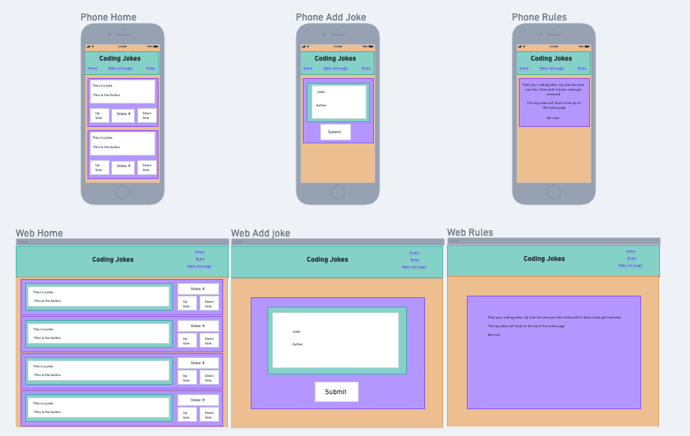
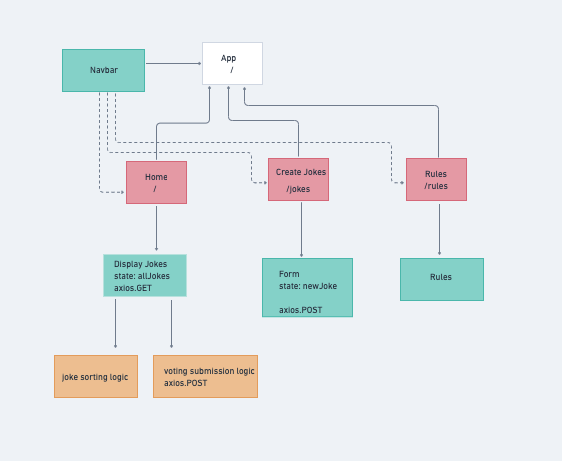

# Project Overview

## Project Name

Vote a Joke

## Project Description

This site allows users to up vote and down vote submissions from other users. It also allows users to submit thier own content for voting.

## Wireframes

https://whimsical.com/p2-QpcFUjY65VYvSjYYcCdJQ8


## Component Hierarchy

https://whimsical.com/p2-QpcFUjY65VYvSjYYcCdJQ8



## API and Data Sample

```json
{
    "records": [
        {
            "id": "recwzrbDzkJCkt9kA",
            "fields": {
                "author": "Jeff B.",
                "votes": 13,
                "joke": "Did you hear about the monkeys who shared an Amazon account? They were Prime mates."
            },
            "createdTime": "2021-09-20T22:08:08.000Z"
        },
```

### MVP/PostMVP

#### MVP

- Use external api (airtable)
- Render data on page
- Create vote system
- Have votes display jokes from highest to lowest

#### PostMVP

- Modify the user submission to have multiple options like a would you rather and include the user to pick options
- Create seperate forums for different topics. Example: jokes, favorite team, would you rather,

## Project Schedule

| Day      | Deliverable                       | Status   |
| -------- | --------------------------------- | -------- |
| 9/16/21  | Get project idea approved         | complete |
| 9/17/21  | Get component hierachery approved | complete |
| 9/18/21  | Set up README & project templates | complete |
| 9/19/21  | Psuedo code                       | complete |
| 9/20/21  | Code                              | complete |
| 9/21/21  | Code                              | complete |
| 9/22/21  | Code/CSS                          | complete |
| 9/23/21  | CSS                               | complete |
| 9/24/21+ | Presentations                     | complete |

## Timeframes

| Component                        | Priority | Estimated Time | Time Invested | Actual Time |
| -------------------------------- | :------: | :------------: | :-----------: | :---------: |
| Routes                           |    H     |      3hrs      |     3hrs      |    3hrs     |
| Joke POST                        |    H     |      3hrs      |     3hrs      |    3hrs     |
| Counter POST                     |    H     |      3hrs      |     3hrs      |    3hrs     |
| Counter GET                      |    H     |      3hrs      |     3hrs      |    3hrs     |
| Render Joke on home page         |    H     |      3hrs      |     3hrs      |    3hrs     |
| Render Count on home page        |    H     |      3hrs      |     3hrs      |    3hrs     |
| API count logic                  |    H     |      3hrs      |     3hrs      |    3hrs     |
| Filling out API to have examples |    L     |      3hrs      |     3hrs      |    3hrs     |
| Setting up containers for CSS    |    M     |      3hrs      |     3hrs      |    3hrs     |
| CSS                              |    M     |      3hrs      |     3hrs      |    3hrs     |
| Total                            |    H     |     34hrs      |     34hrs     |    34hrs    |

## SWOT Analysis

### Strengths:

- Stuck to the initial plan
- Kept the design simiple/straight forward

### Weaknesses:

- I felt I could have done a deeper scope
- I did just above the minimum requirements
- Complacency

### Opportunities:

- Using a styling framework as opposed to pure CSS
- Getting user suggestions for imporved experience

### Threats:

- Not taking into account user suggestions
- Other sites that acomplish the similar content but offer more variety
